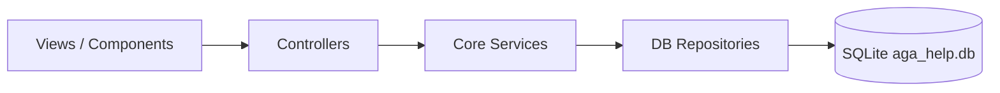

# AGA HELP


**Sistema de Gestão de Ordens de Serviço e Materiais** — aplicação desktop para a operação **Agatek / AGA HELP**, construída em **Python + Flet** com persistência local em **SQLite**.

---

## Sobre o projeto

O **AGA HELP** centraliza o fluxo comercial e produtivo de persianas e componentes: cadastro de pedidos, acompanhamento em Kanban, consulta de materiais do catálogo Agatek e importação de contatos para autocompletar revendas.

A interface é nativa/desktop via [Flet](https://flet.dev/), com arquitetura em camadas que separa UI, regras de negócio e acesso a dados — facilitando manutenção, testes e evolução do sistema.

---

## Principais recursos

| Módulo | Descrição |
|--------|-----------|
| **Formulário inteligente de pedidos** | Cadastro em seções (revenda, especificação, componentes, serviço) com validação **condicional por tipo de serviço** (`componentes`, `rolo`, `horizontal`). Itens vendidos por metro exigem **metragem obrigatória** antes de serem adicionados. |
| **Quadro Kanban** | Visualização responsiva do fluxo **Orçamento → Produção → Pronto → Faturado**, com cards expansíveis e scroll independente por coluna. |
| **Agenda de contatos** | Importação de arquivos **`.vcf`** via seletor nativo (`FilePicker`) e listagem de contatos para alimentar o autocompletar de revendas. |
| **Catálogo de materiais** | Consulta organizada por categorias (horizontais, verticais, perfis, componentes de topo). |
| **Auditoria** | Registro das últimas ações do sistema (importações, exclusões, alterações). |

---

## Arquitetura em camadas

```
aga-help/
├── main.py                 # Bootstrap, navegação e tema global
├── views/                  # Telas (Views) — orquestram layout e eventos
│   ├── kanban_view.py
│   ├── agenda_view.py
│   ├── materials_view.py
│   └── logs_view.py
├── components/             # Widgets reutilizáveis da UI
│   ├── sidebar.py
│   ├── kanban_column.py
│   ├── order_card.py
│   └── order_form/         # Seções do formulário de pedido
├── controllers/            # Estado e regras de formulário
│   └── order_form_controller.py
├── core/                   # Domínio, serviços e persistência
│   ├── services/           # Lógica de negócio (pedidos, contatos, catálogo, VCF)
│   ├── db/                 # Repositórios SQLite e schema
│   ├── components_data.py  # Catálogo estático Agatek
│   └── colors.py           # Design tokens
├── utils/                  # Helpers (tema, formatação, compat Flet, I/O VCF)
└── tests/                  # Suite pytest (31+ testes)
```

### Responsabilidades

| Camada | Papel |
|--------|-------|
| **Views** | Montam telas completas, delegam ações a serviços/controllers e atualizam a UI. |
| **Components** | Blocos visuais compostos (sidebar, cards, seções de formulário). |
| **Controllers** | Coordenam estado do formulário e validações antes de persistir. |
| **Core / Services** | Regras de negócio, sanitização e orquestração de repositórios. |
| **Core / DB** | SQL parametrizado, schema e conexão SQLite (`aga_help.db`). |
| **Utils** | Design system, compatibilidade entre versões do Flet e funções transversais. |

---

## Stack tecnológica

- **Python** 3.10+
- **Flet** 0.86.5 — UI desktop multiplataforma
- **SQLite** — banco local (`aga_help.db`, modo WAL)
- **pytest** — testes automatizados
- **ruff** — lint (configurado em `pyproject.toml`)

---

## Instalação

### Pré-requisitos

- Python 3.10 ou superior
- Git (opcional)

### 1. Clonar o repositório

```bash
git clone https://github.com/brunoacev/aga-help.git
cd aga-help
```

### 2. Criar e ativar o ambiente virtual

**Windows (PowerShell):**

```powershell
python -m venv .venv
.venv\Scripts\Activate.ps1
```

**Linux / macOS:**

```bash
python3 -m venv .venv
source .venv/bin/activate
```

### 3. Instalar dependências

Via `requirements.txt`:

```bash
pip install -r requirements.txt
```

Ou via `pyproject.toml` (inclui dependências de desenvolvimento):

```bash
pip install -e ".[dev]"
```

---

## Execução

Com o ambiente virtual ativo, na raiz do projeto:

```bash
python main.py
```

Alternativa recomendada pelo Flet:

```bash
flet run main.py
```

Na primeira execução, o banco SQLite é criado automaticamente. A janela abre maximizada com o **Quadro Kanban** como tela inicial.

---

## Testes

```bash
pytest tests/ -q
```

Cobertura principal:

- Validação condicional do formulário de pedidos
- Parser e sanitização VCF
- Catálogo e metragem de componentes
- Repositório de contatos e formatação numérica

---

## Fluxo de dados (visão geral)



---

## Padrões de código e commits

O projeto segue as diretrizes definidas em `.cursorrules`:

- **PEP 8**, type hints e docstrings em funções públicas
- **SOLID** e **Clean Code** — arquivos pequenos, responsabilidade única, sem misturar UI e regra de negócio
- **Segurança** — entradas sanitizadas (VCF, formulários, SQL parametrizado)
- **Conventional Commits** — mensagens padronizadas, por exemplo:

```text
feat(agenda): simplifica importacao VCF com busca e tabela de contatos
fix(ui): corrige agenda, kanban e validacao de metragem em componentes
refactor(app): modulariza arquitetura e validacao condicional de pedidos
```

Prefixos comuns: `feat`, `fix`, `refactor`, `test`, `docs`, `chore`.

---

## Banco de dados

| Arquivo | Descrição |
|---------|-----------|
| `aga_help.db` | Banco principal (gerado em runtime) |
| `aga_help.db-wal` / `aga_help.db-shm` | Arquivos auxiliares WAL (ignorados no Git) |

Tabelas principais: `orders`, `contacts`, `logs`.

---

## Licença

Uso interno **Agatek / AGA HELP**. Consulte o mantenedor do repositório para termos de distribuição.

---

## Contato

Repositório: [github.com/brunoacev/aga-help](https://github.com/brunoacev/aga-help)
